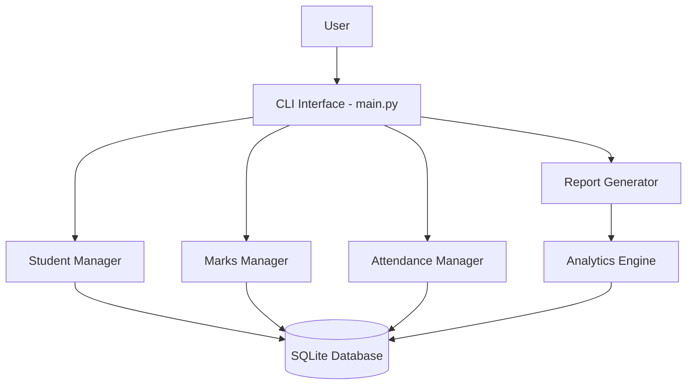
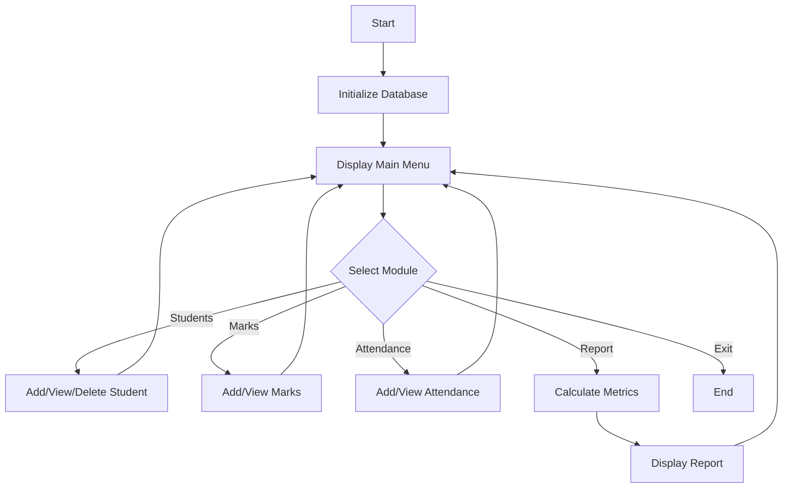
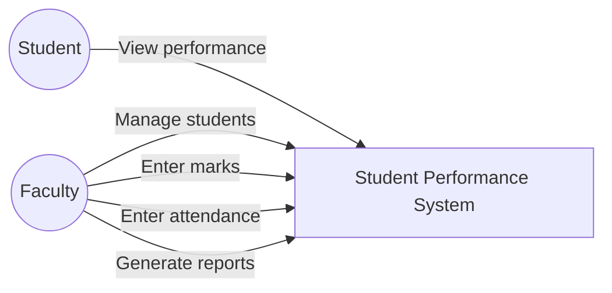
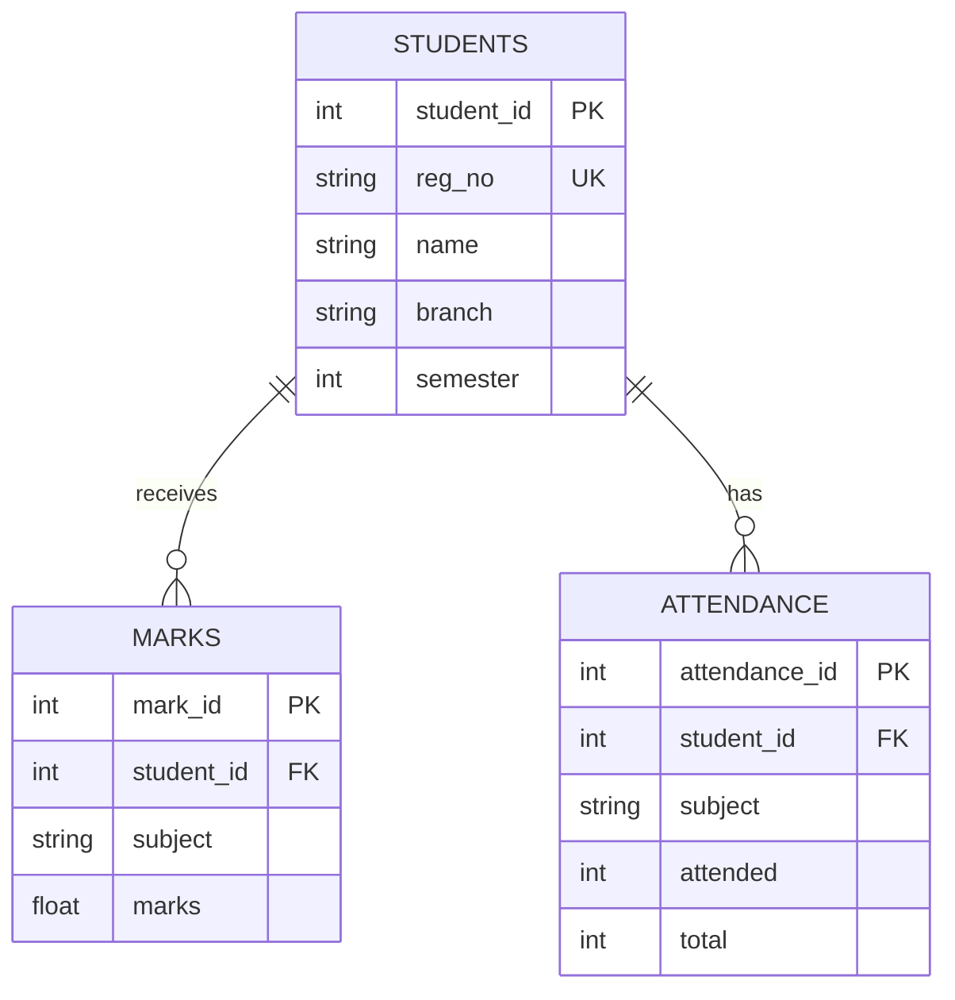
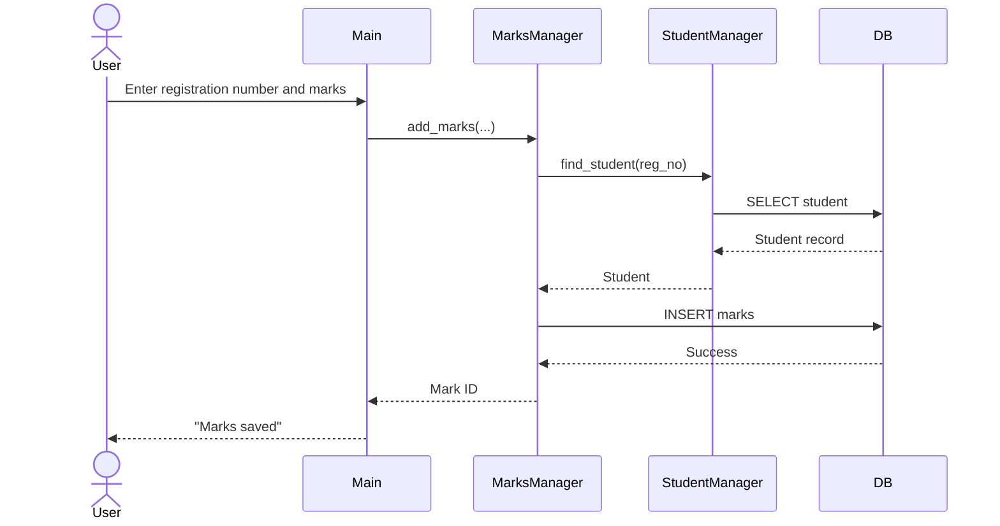
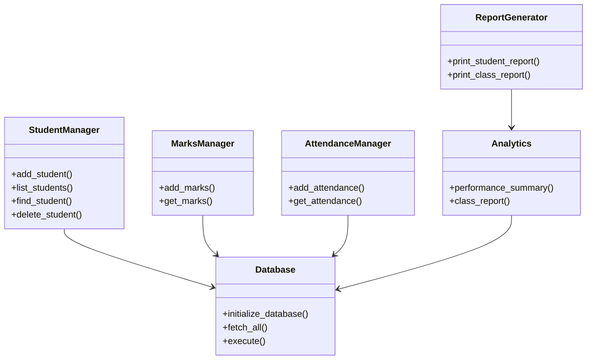

# Design Diagrams

## 1. System Architecture

```mermaid
flowchart TD
    U[User] --> UI[CLI Interface - main.py]
    UI --> SM[Student Manager]
    UI --> MM[Marks Manager]
    UI --> AM[Attendance Manager]
    UI --> RG[Report Generator]
    SM --> DB[(SQLite Database)]
    MM --> DB
    AM --> DB
    RG --> AN[Analytics Engine]
    AN --> DB
```

## 2. Workflow

```mermaid
flowchart TD
    A[Start] --> B[Initialize Database]
    B --> C[Display Main Menu]
    C --> D{Select Module}
    D -->|Students| E[Add/View/Delete Student]
    D -->|Marks| F[Add/View Marks]
    D -->|Attendance| G[Add/View Attendance]
    D -->|Report| H[Calculate Metrics]
    E --> C
    F --> C
    G --> C
    H --> I[Display Report]
    I --> C
    D -->|Exit| J[End]
```

## 3. Use Case Diagram

```mermaid
flowchart LR
    Student((Student))
    Faculty((Faculty))
    System[Student Performance System]

    Student -->|View performance| System
    Faculty -->|Manage students| System
    Faculty -->|Enter marks| System
    Faculty -->|Enter attendance| System
    Faculty -->|Generate reports| System
```

## 4. Entity Relationship Diagram

```mermaid
erDiagram
    STUDENTS ||--o{ MARKS : receives
    STUDENTS ||--o{ ATTENDANCE : has

    STUDENTS {
        int student_id PK
        string reg_no UK
        string name
        string branch
        int semester
    }

    MARKS {
        int mark_id PK
        int student_id FK
        string subject
        float marks
    }

    ATTENDANCE {
        int attendance_id PK
        int student_id FK
        string subject
        int attended
        int total
    }
```

## 5. Sequence: Add Marks

```mermaid
sequenceDiagram
    actor User
    participant Main
    participant MarksManager
    participant StudentManager
    participant DB

    User->>Main: Enter registration number and marks
    Main->>MarksManager: add_marks(...)
    MarksManager->>StudentManager: find_student(reg_no)
    StudentManager->>DB: SELECT student
    DB-->>StudentManager: Student record
    StudentManager-->>MarksManager: Student
    MarksManager->>DB: INSERT marks
    DB-->>MarksManager: Success
    MarksManager-->>Main: Mark ID
    Main-->>User: "Marks saved"
```

## 6. Component/Class-Level View

```mermaid
classDiagram
    class Database {
        +initialize_database()
        +fetch_all()
        +execute()
    }
    class StudentManager {
        +add_student()
        +list_students()
        +find_student()
        +delete_student()
    }
    class MarksManager {
        +add_marks()
        +get_marks()
    }
    class AttendanceManager {
        +add_attendance()
        +get_attendance()
    }
    class Analytics {
        +performance_summary()
        +class_report()
    }
    class ReportGenerator {
        +print_student_report()
        +print_class_report()
    }

    StudentManager --> Database
    MarksManager --> Database
    AttendanceManager --> Database
    Analytics --> Database
    ReportGenerator --> Analytics
```
